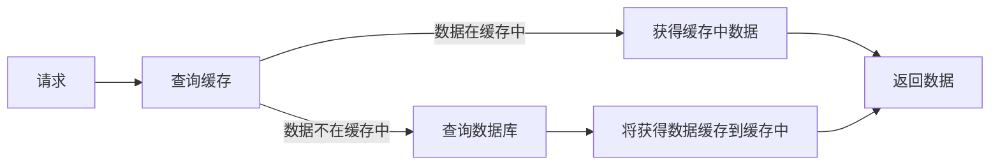

# 前言

近期有同学问我，怎么在不使用spring自带的`@Cacheable`来 使用aop方式用redis为项目接口调用添加缓存，在这里总结整理一下，博文难免会有纰漏，如有问题请评论不吝告知。

在本文章，你会了解到如何使用redis，以及如何通过jedis操作redis通过AOP的方式实现缓存。在文章后面还介绍了AOP的相关知识点，希望对大家有些许帮助~

> 如果转载此博文，请附上本文链接，谢谢合作~
> 如果感觉这篇文章对您有所帮助，请“点赞”或者“关注”博主，您的喜欢和关注将是我前进的最大动力~

# 一：环境准备

## 1：准备Redis环境

使用redis做缓存的话，需要有redis服务，可以将服务部署在远程服务器上，也可以部署到本机上。

### 1.1. 部署在linux服务器

> 1.1.1安装Redis

```bash
#安装redis，当前最新的版本是redis-5.0.0.tar.gz，可以通过http://download.redis.io/releases地址查看最新版本
$ wget http://download.redis.io/releases/redis-5.0.0.tar.gz
$ tar xzf redis-5.0.0.tar.gz
$ cd redis-5.0.0
$ make

```

> 1.1.2启动Redis服务并使用

```bash
 #启动redis服务
$ cd src
$ ./redis-server
#使用redis客户端测试redis
$ cd src
$ ./redis-cli
redis> set testkey  testvalue
OK
redis> get testkey
"testvalue"

```

> 如果上述过程没有报错的话，那么恭喜你启动redis服务成功，下面我们将会使用jedis操作redis来实现缓存

### 1.2. 部署在windows服务器

> 2.1下载redis压缩包
>
> > 下载zip压缩包（Redis\-x64\-\*.zip）：[https://github.com/MSOpenTech/redis/releases](https://links.jianshu.com/go?to=https%3A%2F%2Fgithub.com%2FMSOpenTech%2Fredis%2Freleases)
> > 将其解压到某一文件夹中，重命名为Redis

> 2.2启动redis服务并使用
>
> > 打开cmd，切换到解压的Redis文件夹中，运行如下命令,
> > 会发现出现”The server is now ready to accept connections on port 6379“字样表示启动成功

```bash
redis-server.exe redis.windows.conf

```

> > 再打开一个cmd，`原来的cmd不要关闭，保持打开状态`，输入以下命令：
> > 其中： `127.0.0.1：为你的redis服务ip地址，如果是本机安装的就是127.0.0.1`，端口6379是redis默认监听的端口

```bash
redis-cli.exe -h 127.0.0.1 -p 6379
#如果redis设置了密码，可以添加参数-a指定密码，例如：
redis-cli.exe -h 127.0.0.1 -p 6379 -a 12345

```

> 可以使用redis命令测试是否可以正常使用，至此redis服务便准备完毕了~

## 2：准备项目环境

1.  首先spring boot项目，当然不是boot项目也可以，我是以boot项目举例的
2.  pom文件添加依赖，只列出了此功能设计特殊所需的
    ps: 以下版本为截止2019/10/10最新版本

```xml
        <!--jedis依赖-->
        <dependency>
            <groupId>redis.clients</groupId>
            <artifactId>jedis</artifactId>
            <version>3.1.0</version>
        </dependency>
        <!--用于序列化 -->
        <dependency>
            <groupId>com.alibaba</groupId>
            <artifactId>fastjson</artifactId>
            <version>1.2.62</version>
        </dependency>

```

3.  application.yml添加配置，如果你是xml格式的文件，yml格式和xml格式类似，只是yml格式更加明了一些，google一下转换一下格式就行

```yml
spring:
  jedis:
    max:
      total: 100     #jedis总量
      idle: 50        #空闲jedis实例最大值
      waitmillis: 500   #当池内没有返回jedis对象时，最大等待时间
      timout: 0      #当客户端闲置多长时间后关闭连接，如果指定为 0，表示关闭该功能，连接不会断
    host: 127.0.0.1  # redis服务ip地址
    port: 6379        # 端口
    password: test  # redis密码

```

ps ： [redis的常用配置参数](https://links.jianshu.com/go?to=https%3A%2F%2Fwww.runoob.com%2Fredis%2Fredis-conf.html)

> 此处的参数需要根据想要缓存接口的调用情况进行动态配置。
> 至此，环境配置完成了，现在只需要操作redis实现缓存了~~

# 二：缓存功能实现

## 1：过程简介

1.  对于不加缓存的项目，我们每一次的请求都会去数据库中查询，即使两次请求一样并且获取的数据一样，也是会去查询数据库，这就造成了数据库资源的浪费，并且如果并发量特别高的话，数据库的压力太大，容易造成查询缓慢、数据库宕机、查询失败等问题。
2.  项目添加缓存之后，请求查询数据的时候会先查询缓存，缓存（这里指只有一级缓存）中没有才会到达数据库。相同的请求在缓存还没有过期 的情况下，会得到缓存中的数据并返回，不会到达数据库，这样做即减少了数据库的压力提高了并发量又提升了查询速度。
3.  简易流程图：



## 2：缓存AOP实现

**`在使用aop之前，先大致的了解一下 aop：`**

AOP（Aspect Oriented Programing）：面向切面编程，将通用的逻辑从业务逻辑中分离出来。

AOP把软件系统分为两个部分：核心关注点和横切关注点：

*   主要的业务处理部分。业务处理的主要流程是核心关注点，与之关系不大的部分是横切关注点。
*   横切关注点的一个特点是，他们经常发生在核心关注点的多处，而各处都基本相似。比如权限认证、日志、事务处理。Aop 的作用在于分离系统中的各种关注点，将核心关注点和横切关注点分离开来。

正如Avanade公司的高级方案构架师Adam Magee所说，AOP的核心思想就是“将应用程序中的商业逻辑同对其提供支持的通用服务进行分离”。

AOP的底层实现主要是依赖动态代理来实现的：

*   比如Spring aop底层使用JDK proxy（实现接口）和CGLib（继承目标类、使用ASM库）来生成代理类来代替目标类执行，默认使用JDK proxy ,当无接口时使用CGLib。底层采用动态代理技术（动态代理技术底层依赖的反射技术）在运行期动态生成代理类（不同于aspectJ编译期织入代码到目标类）。
*   再比如AspectJ做为java实现的统一AOP解决方案，使用ASM字节码操作库，需要使用特定的acj编译器（不同于spring使用动态代理）在编译期将代码直接织入到目标类。

> 下面会详细介绍aop相关

### 2.1.执行过程

1.  请求到达`Controller`中的接口时，因为我们在`CacheAspect`类中配置的切入点包含这个接口，所以进入`CacheAspect`类的`doAround`方法中执行缓存操作
2.  在`doAround`中，首先获取key，判断redis中是否包含key，包含就返回缓存中的数据，完成请求
3.  不包含就执行调用的接口通过查询数据库获取数据，并将其缓存到redis中，完成一次请求不包含就执行调用的接口通过查询数据库获取数据，并将其缓存到redis中，完成请求

### 2.2. 组成部分与实现

*   自定义注解：`NeedCacheAop`

> 用在方法上面标识调用该方法的请求需要被缓存
> 其中的nxxx、expx、time等参数是为了可以更灵活的空值缓存的方式与过期时间，具体含义请看下面”其他“中的set方法参数解析

```java
/**
 * 自定义注解，用于标识方法是否需要使用缓存
 */
@Target({ElementType.PARAMETER, ElementType.METHOD,ElementType.TYPE})
@Retention(RetentionPolicy.RUNTIME)
@Documented
public @interface NeedCacheAop {
    //代表缓存策咯，nx:代表key不存在再进行缓存kv，xx:代表key存在再进行缓存kv  默认为"不存在key缓存key"
    String nxxx() default "nx";
    //代表过期时间单位，ex:秒 px:毫秒    默认为"秒"
    String expx() default "ex";
    //过期时间
    long time() default 30*60;
}

```

*   序列化工具类：`SerializeUtil`

> 使用FastJso对要缓存的数据进行序列化后存储与获取缓存中的反序列化
> 使用fastjson对数据进行序列化与反序列化，非常简单

```java
public class SerializeUtil {
    private  static Logger logger = LoggerFactory.getLogger("SerializeUtil");
    public static String serializeObject(Object obj){
        logger.info("serialize object ："+obj);
        String jsonObj = JSON.toJSONString(obj);
        return jsonObj;
    }
    public static JSONObject unserializeObject(String serobj){
        logger.info("unserialize object ："+serobj);
        JSONObject jsonObj = JSON.parseObject(serobj);
        return jsonObj;
    }
}

```

*   操作缓存service类：`CacheService`接口 与其实现类 `CacheServiceImpl`

> 方法内部封装了关于缓存的get set containKey getKeyAop等方法

```java
public interface CacheService {
    /**获取jedis实例*/
    Jedis getResource() throws Exception;
    /**设置key与value*/
    void set(String key, String value, String nxxx, String expx, long time);
    /**根据key获取value*/
    String get(String key);
    /**判断是否存在key*/
    boolean containKey(String key);
    /**释放jedis实例资源*/
    void returnResource(Jedis jedis);
    /**获取key*/
    String getKeyForAop(JoinPoint joinPoint, HttpServletRequest request);
}

```

```java
@Service
public class CacheServiceImpl implements CacheService {
    private static Logger logger = LoggerFactory.getLogger(CacheServiceImpl.class);

    @Autowired
    private JedisPool jedisPool;

    /**获取jedis实例*/
    public Jedis getResource() throws Exception{
        return jedisPool.getResource();
    }

    /**设置key与value*/
    public void set(String key, String value,String nxxx,String expx,long time) {
        Jedis jedis=null;
        try{
            jedis = getResource();
            jedis.set(key,value,nxxx,expx,time);
        } catch (Exception e) {
            logger.error("Redis set error: "+ e.getMessage() +" - " + key + ", value:" + value);
        }finally{
            returnResource(jedis);
        }
    }

    /**根据key获取value*/
    public String get(String key) {
        String result = null;
        Jedis jedis=null;
        try{
            jedis = getResource();
            result = jedis.get(key);
        } catch (Exception e) {
            logger.error("Redis set error: "+ e.getMessage() +" - " + key + ", value:" + result);
        }finally{
            returnResource(jedis);
        }
        return result;
    }

    /**判断是否存在key*/
    public boolean containKey(String key){
        boolean b;
        Jedis jedis = null;
        try{
            jedis = getResource();
            b = jedis.exists(key);
            return b;
        }catch (Exception e){
            logger.error("Redis server error:："+e.getMessage());
            return false;
        }finally {
            returnResource(jedis);
        }
    }

    /**释放jedis实例资源*/
    public void returnResource(Jedis jedis) {
        if(jedis != null){
            jedis.close();
        }
    }

    /**获取key*/
    public String getKeyForAop(JoinPoint joinPoint, HttpServletRequest request){
        //获取参数的序列化
        Object[] objects = joinPoint.getArgs();
        String args = SerializeUtil.serializeObject(objects[0]);
        //获取请求url
        String url = request.getRequestURI();
        //获取请求的方法
        String method = request.getMethod();
        //获取当前日期,规避默认init情况
        String date = LocalDate.now().toString();
        //key值获取
        return args + url + method + date;
    }
}

```

*   切面类：`CacheAspect`

> 用于对相应的请求接口切入缓存存取的相关逻辑，使用AOP可以对代码0侵入性，是一个很好的方法

```java
@Component
@Aspect
public class CacheAspect {

    @Autowired
    CacheService cacheService;

    /**设置切入点*/
    //方法上面有@NeedCacheAop的方法,增加灵活性
    @Pointcut("@annotation(com.xcar.data.web.backend.util.annotation.NeedCacheAop)")
    public void annotationAspect(){}
    //相应包下所有以XcarIndex开头的类中的所有方法，减少代码侵入性
    @Pointcut("execution(public * com.xcar.data.web.backend.controller.XcarIndex*.*(..))")
    public void controllerAspect(){}

    /**环绕通知*/
    @Around(value = "controllerAspect()||annotationAspect()")
    public Object doAround(ProceedingJoinPoint joinPoint){
        //获取请求
        HttpServletRequest request = ((ServletRequestAttributes) RequestContextHolder
                .getRequestAttributes()).getRequest();
        //存储接口返回值
        Object object = new Object();

        //获取注解对应配置过期时间
        NeedCacheAop cacheAop = ((MethodSignature)joinPoint.getSignature()).getMethod().getAnnotation(NeedCacheAop.class);  //获取注解自身
        String nxxx;String expx;long time;
        if (cacheAop == null){//规避使用第二种切点进行缓存操作的情况
            nxxx = "nx";
            expx = "ex";
            time = 30*60;  //默认过期时间为30分钟
        }else{
            nxxx = cacheAop.nxxx();
            expx = cacheAop.expx();
            time = cacheAop.time();
        }
        //获取key
        String key = cacheService.getKeyForAop(joinPoint,request);
        if (cacheService.containKey(key)){
            String obj = cacheService.get(key);
            if ("fail".endsWith(obj)){  //规避redis服务不可用
                try {
                    //执行接口调用的方法
                    joinPoint.proceed();
                } catch (Throwable throwable) {
                    throwable.printStackTrace();
                }
            }else{
                JSONObject klass =  SerializeUtil.unserializeObject(obj);
                return new ResponseEntity<>(klass.get("body"), HttpStatus.OK) ;
            }
        }else{
            try {
                ////执行接口调用的方法并获取返回值
                object = joinPoint.proceed();
                String serobj = SerializeUtil.serializeObject(object);
                cacheService.set(key,serobj,nxxx,expx,time);
            } catch (Throwable throwable) {
                throwable.printStackTrace();
            }
        }
        return object;
    }
}

```

*   jedis配置类：`JedisConfiguration`

> 用于配置JedisPool的相关参数，与创建JedisPool对象，便于后面注入使用

```java
@Configuration
public class JedisConfiguration extends CachingConfigurerSupport {
    private Logger logger = LoggerFactory.getLogger(JedisConfiguration.class);
    @Value("${spring.jedis.port}")
    private Integer port;
    @Value("${spring.jedis.host}")
    private String host;
    @Value("${spring.jedis.max.total}")
    private Integer maxTotal;
    @Value("${spring.jedis.max.idle}")
    private Integer maxIdle;
    @Value("${spring.jedis.max.waitmillis}")
    private Long maxWaitMillis;
    @Value("${spring.jedis.password}")
    private String password;

    public JedisConfiguration() {}
    /**设置*/
    @Bean
    public JedisPool redisPoolFactory(){
        JedisPoolConfig jedisPoolConfig = new JedisPoolConfig();
        jedisPoolConfig.setMaxIdle(maxIdle);
        jedisPoolConfig.setMaxWaitMillis(maxWaitMillis);
        jedisPoolConfig.setMaxTotal(maxTotal);
        JedisPool jedisPool = new JedisPool(jedisPoolConfig,host,port,1000,password);
        logger.info("JedisPool build success!");
        logger.info("Redis host：" + host + ":" + port);
        return  jedisPool;
    }
    //下面属性是get set方法省略
 }

```

*   响应数据对象：`XcarIndexCarAttentionIndexResponse`

> 响应的数据对象，缓存就是对其进行序列化后缓存
> 该对象类一定继承Serializable接口，使其可被序列化，例如：

``` java
public class XcarIndexCarAttentionIndexResponse implements Serializable{
    priate List<BaseChartsResponse.Line> lines = new ArrayList<>();
    private Series_DateBubble series_datebubble = new Series_DateBubble();
    private String flag = "1";
    public Series_DateBubble getSeries_datebubble() {
        if (series_datebubble == null) {
            series_datebubble = new Series_DateBubble();
        }
        return series_datebubble;
    }
    public String getFlag() {
        return flag;
    }
    public void setFlag(String flag) {
        this.flag = flag;
    }
    public void setSeries_datebubble(Series_DateBubble series_datebubble) {
        this.series_datebubble = series_datebubble;
    }
    public List<BaseChartsResponse.Line> getLines() {
        return lines;
    }
    public void setLines(List<BaseChartsResponse.Line> lines) {
        this.lines = lines;
    }
    public class Series_DateBubble {
        private List<BaseChartsResponse.Series_DateBubble> datas = new ArrayList<>();
        private String[] dataRange = {};
        public List<BaseChartsResponse.Series_DateBubble> getDatas() {
            return datas;
        }
        public void setDatas(List<BaseChartsResponse.Series_DateBubble> datas) {
            this.datas = datas;
        }
        public String[] getDataRange() {
            return dataRange;
        }
        public void setDataRange(String[] dataRange) {
            this.dataRange = dataRange;
        }
    }
}

```

*   被切入的方法：`getTrendPage`

> 我们要添加缓存的Controller接口的实现，例如：我要切入的接口

``` java
package com.xcar.data.web.backend.controller;
    @RequestMapping(value = "/page/trend", method = RequestMethod.POST)
    public ResponseEntity<XcarIndexCarIntentionIndexResponse> getTrendPage(@RequestBody XcarIndexCarIntentionIndexRequest ro, HttpServletRequest request) throws Exception {
        XcarIndexCarIntentionIndexResponse res = new XcarIndexCarIntentionIndexResponse();
        try {
            res = delegate.getTrendPage(ro);
        } catch (Exception e) {
            throw e;
        }
        return new ResponseEntity(res, HttpStatus.OK);
    }

```

### 2.3.非AOP实现

在一些情况下，我们需要对方法内部一些中间查询结果进行缓存，这样就只能将缓存数据的代码直接写在方法体内，实现也相对AOP实现方式来说更加简单，调用相关的jedis方法即可，可参考上述代码实现。

# 三：知识点

## 1：jedis中set方法参数：

*   key ：缓存的key值
*   value ：缓存的value值
*   nxxx： NX|XX两种选择， NX \-\- 缓存不存在时才进行缓存. XX \-\- 缓存存在时再进行缓存
*   expx ：EX|PX两种选择， 过期时间的代为，EX 代表秒; PX 代表毫秒
*   time ：过期时间的数值

## 2：AOP面向切面编程

如上述所说：

AOP（Aspect Oriented Programing）：面向切面编程，将通用的逻辑从业务逻辑中分离出来。AOP把软件系统分为两个部分：核心关注点和横切关注点。业务处理的主要流程是核心关注点，与之关系不大的部分是横切关注点。横切关注点的一个特点是，他们经常发生在核心关注点的多处，而各处都基本相似。比如权限认证、日志、事务处理。Aop 的作用在于分离系统中的各种关注点，将核心关注点和横切关注点分离开来。

正如Avanade公司的高级方案构架师Adam Magee所说，AOP的核心思想就是“将应用程序中的商业逻辑同对其提供支持的通用服务进行分离”。

AOP的底层实现主要是依赖动态代理来实现的：

*   比如Spring aop底层使用JDK proxy（实现接口）和CGLib（继承目标类、使用ASM库）来生成代理类来代替目标类执行，默认使用JDK proxy ,当无接口时使用CGLib。底层采用动态代理技术（动态代理技术底层依赖的反射技术）在运行期动态生成代理类（不同于aspectJ编译期织入代码到目标类）。
*   再比如AspectJ做为java实现的统一AOP解决方案，使用ASM字节码操作库，需要使用特定的acj编译器（不同于spring使用动态代理）在编译期将代码直接织入到目标类。

AOP相关概念：

*   **连接点（Joinpoint）**: 表示需要在程序中插入横切关注点的扩展点，连接点可能是类初始化、方法执行、方法调用、字段调用或处理异常等等，Spring只支持方法执行连接点；在AOP中表示为“在哪里干”；
*   **切入点（Pointcut）**: 选择一组相关连接点的模式，即可以认为连接点的集合，Spring支持perl5正则表达式和AspectJ切入点模式，Spring默认使用AspectJ语法；在AOP中表示为“在哪里干的集合”；
*   **通知（Advice）**: 在连接点上执行的行为，通知提供了在AOP中需要在切入点所选择的连接点处进行扩展现有行为的手段；包括前置通知（before advice）、后置通知(after advice)、环绕通知（around advice），在Spring中通过代理模式实现AOP，并通过拦截器模式以环绕连接点的拦截器链织入通知；在AOP中表示为“干什么”；
*   **切面（Aspect）**：横切关注点的模块化，比如日志组件。可以认为是通知、引入和切入点的组合；在Spring中可以使用Schema和@AspectJ方式进行组织实现；在AOP中表示为“在哪干和干什么集合”；
*   **引入（Introduction）**: 也称为内部类型声明，为已有的类添加额外新的字段或方法，Spring允许引入新的接口（必须对应一个实现）到所有被代理对象（目标对象）；在AOP中表示为“干什么（引入什么）”；
*   **目标对象（Target Object）**:需要被织入横切关注点的对象，即该对象是切入点选择的对象，需要被通知的对象，从而也可称为“被通知对象”；由于Spring AOP 通过代理模式实现，从而这个对象永远是被代理对象；在AOP中表示为“对谁干”；
*   **AOP代理（AOP Proxy）**: AOP框架使用代理模式创建的对象，从而实现在连接点处插入通知（即应用切面），就是通过代理来对目标对象应用切面。在Spring中，AOP代理可以用JDK动态代理或CGLIB代理实现，而通过拦截器模型应用切面。
*   **织入（Weaving）**: 织入是一个过程，是将切面应用到目标对象从而创建出AOP代理对象的过程，织入可以在编译期、类装载期、运行期进行。组装方面来创建一个被通知对象。这可以在编译时完成（例如使用AspectJ编译器），也可以在运行时完成（jdk自带的动态代理）。Spring和其他纯Java AOP框架一样，在运行时完成织入。

## 3：AOP中切点表达式

**切点指示符**
切点指示符是切点定义的关键字，切点表达式以切点指示符开始。开发人员使切点指示符来告诉切点将要匹配什么，有以下9种切点指示符：execution、within、this、target、args、@target、@args、@within、@annotation，下面一一介结这9种切点指示符。

**execution**
execution是一种使用频率比较高比较主要的一种切点指示符，用来匹配方法签名，方法签名使用全限定名，包括访问修饰符（public/private/protected）、返回类型，包名、类名、方法名、参数，其中返回类型，包名，类名，方法，参数是必须的，如下面代码片段所示：

> @Pointcut("execution(public String org.baeldung.dao.FooDao.findById(Long))")
> 上面的代码片段里的表达式精确地匹配到FooDao类里的findById(Long)方法，但是这看起来不是很灵活。假设我们要匹配FooDao类的所有方法，这些方法可能会有不同的方法名，不同的返回值，不同的参数列表，为了达到这种效果，我们可以使用通配符。如下代码片段所示：

> @Pointcut("execution(\* org.baeldung.dao.FooDao.\*(..))")

第一个通配符匹配所有返回值类型，第二个匹配这个类里的所有方法，（）括号表示参数列表，括号里的用两个点号表示匹配任意个参数，包括0个

**within**
使用within切点批示符可以达到上面例子一样的效果，within用来限定连接点属于某个确定类型的类。如下面代码的效果与上面的例子是一样的：

> @Pointcut("within(org.baeldung.dao.FooDao)")
> 我们也可以使用within指示符来匹配某个包下面所有类的方法（包括子包下面的所有类方法），如下代码所示：
> @Pointcut("within(org.baeldung..\*)")

**this 和 target**
this用来匹配的连接点所属的对象引用是某个特定类型的实例，target用来匹配的连接点所属目标对象必须是指定类型的实例；那么这两个有什么区别呢？原来AspectJ在实现代理时有两种方式：

> 1、如果当前对象引用的类型没有实现自接口时，spring aop使用生成一个基于CGLIB的代理类实现切面编程
> 2、如果当前对象引用实现了某个接口时，Spring aop使用JDK的动态代理机制来实现切面编程
> this指示符就是用来匹配基于CGLIB的代理类，通俗的来讲就是，如果当前要代理的类对象没有实现某个接口的话，则使用this；target指示符用于基于JDK动态代理的代理类，通俗的来讲就是如果当前要代理的目标对象有实现了某个接口的话，则使用target.：
> public class FooDao implements BarDao {
> ...

}
比如在上面这段代码示例中，spring aop将使用jdk的动态代理来实现切面编程，在编写匹配这类型的目标对象的连接点表达式时要使用target指示符， 如下所示：

> @Pointcut("target(org.baeldung.dao.BarDao)")
> 如果FooDao类没有实现任何接口，或者在spring aop配置属性：proxyTargetClass设为true时，Spring Aop会使用基于CGLIB的动态字节码技为目标对象生成一个子类将为代理类，这时应该使用this指示器：

> @Pointcut("this(org.baeldung.dao.FooDao)")

**参数**
参数指示符是一对括号所括的内容，用来匹配指定方法参数：

> @Pointcut("execution(\* \*..find*(Long))")
> 这个切点匹配所有以find开头的方法，并且只一个Long类的参数。如果我们想要匹配一个有任意个参数，但是第一个参数必须是Long类的，我们这可使用下面这个切点表达式：
> @Pointcut("execution(* \*..find\*(Long,..))")

@Target
这个指示器匹配指定连接点，这个连接点所属的目标对象的类有一个指定的注解:

> @Pointcut("@target(org.springframework.stereotype.Repository)")

@args
这个指示符是用来匹配连接点的参数的，@args指出连接点在运行时传过来的参数的类必须要有指定的注解，假设我们希望切入所有在运行时接受实@Entity注解的bean对象的方法：

> @Pointcut("@args(org.baeldung.aop.annotations.Entity)")
> public void methodsAcceptingEntities() {}

为了在切面里接收并使用这个被@Entity的对象，我们需要提供一个参数给切面通知：JointPoint:

``` java
 @Before("methodsAcceptingEntities()")
 public void logMethodAcceptionEntityAnnotatedBean(JoinPoint jp) {
 logger.info"Accepting beans with @Entity annotation: " + jp.getArgs()\[0\]);
 }
```

@within这个指示器，指定匹配必须包括某个注解的的类里的所有连接点：

``` java
 @Pointcut("@within(org.springframework.stereotype.Repository)")
 上面的切点跟以下这个切点是等效的：

 @Pointcut("within(@org.springframework.stereotype.Repository \*)")
```

@annotation
这个指示器匹配那些有指定注解的连接点，比如，我们可以新建一个这样的注解@Loggable:

``` java
 @Pointcut("@annotation(org.baeldung.aop.annotations.Loggable)")
 public void loggableMethods() {}
```

 我们可以使用@Loggable注解标记哪些方法执行需要输出日志：
``` java
 @Before("loggableMethods()")
 public void logMethod(JoinPoint jp) {
 String methodName = jp.getSignature().getName();
 logger.info("Executing method: " + methodName);
 }
```

**切点表达式组合**
可以使用&&、||、!、三种运算符来组合切点表达式，表示与或非的关系。

``` java
 @Pointcut("@target(org.springframework.stereotype.Repository)")
 public void repositoryMethods() {}

 @Pointcut("execution(\* \*..create\*(Long,..))")
 public void firstLongParamMethods() {}

 @Pointcut("repositoryMethods() && firstLongParamMethods()")
 public void entityCreationMethods() {}
``` 

# 总结

上述描述的缓存实现通过AOP方式实现了对代码的低侵入性，使用常用的nosql数据库redis做缓存数据库，使用jedis调用redis API进行数据操作。
